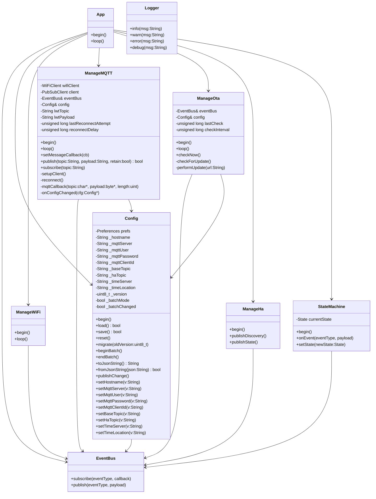
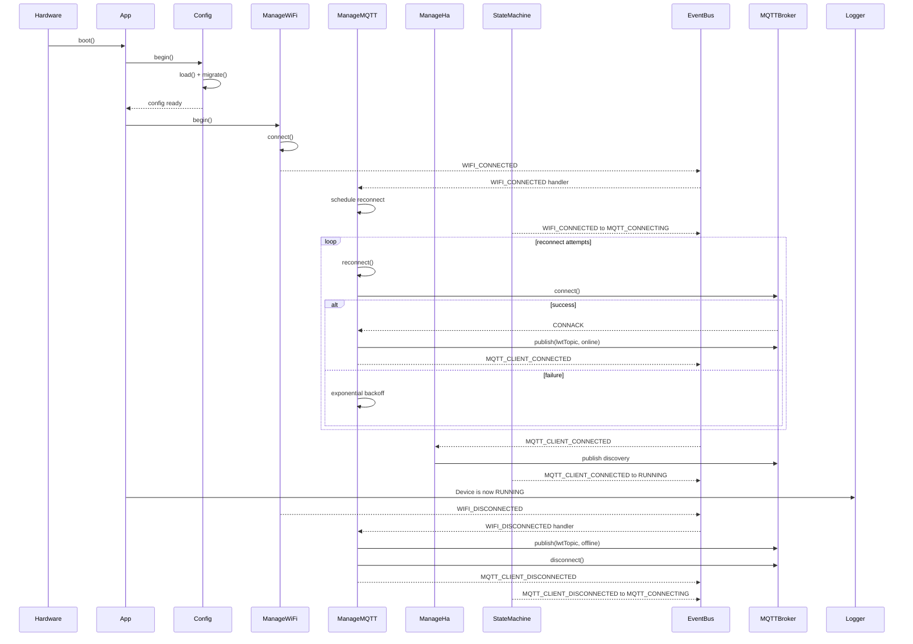
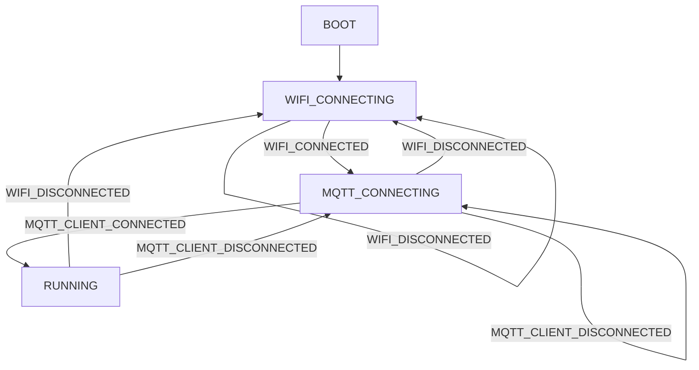

# **ESP Modular IoT Framework**

## 🧩 Overview

This project is a **modular, event‑driven ESP8266/ESP32 IoT framework** designed for clean architecture, maintainability, and reusability across multiple devices.

It provides:

- A **central event bus** for decoupled communication
- A **persistent configuration system** (Preferences + JSON)
- Modular managers for **WiFi**, **MQTT**, **OTA**, **Home Assistant**, and **State Machine**
- A clean **App** layer that wires everything together
- A predictable, testable boot and runtime flow

The result is firmware that is easy to extend, debug, and reuse.

## 🏗️ Folder Structure

```
src/
  app/
    App.h
    App.cpp

  config/
    Config.h
    Config.cpp
    AppConfig.h

  core/
    Logger.h
    Logger.cpp
    EventBus.h
    EventBus.cpp
    StateMachine.h
    StateMachine.cpp

  wifi/
    ManageWiFi.h
    ManageWiFi.cpp

  mqtt/
    ManageMQTT.h
    ManageMQTT.cpp

  ota/
    ManageOta.h
    ManageOta.cpp

  ha/
    ManageHa.h
    ManageHa.cpp

  utils/
    StringUtils.h
    StringUtils.cpp
```

Each module has a **single responsibility**, and all communication happens through the **EventBus**.

## ⚙️ Core Architecture

### **EventBus**

A lightweight publish/subscribe system that allows modules to communicate without knowing about each other.

Events include:

- `WIFI_CONNECTED`
- `WIFI_DISCONNECTED`
- `MQTT_CLIENT_CONNECTED`
- `MQTT_CLIENT_DISCONNECTED`
- `CONFIG_CHANGED`
- `OTA_AVAILABLE`
- `OTA_PROGRESS`
- `OTA_DONE`

This keeps modules **fully decoupled**.

### **Config**

Persistent configuration stored in Preferences as a JSON blob.

Features:

- Batch mode (prevents event storms)
- Equality‑checked setters (prevents loops)
- Migration support
- Runtime change notifications via `CONFIG_CHANGED`

### **ManageWiFi**

Handles:

- WiFi connection
- WiFiManager portal
- Emitting WiFi events
- Hostname setup

### **ManageMQTT**

Handles:

- MQTT connection
- Exponential reconnect backoff
- Automatic re‑subscription
- Availability publishing (`online` / `offline`)
- Reacting to MQTT‑related config changes only

### **ManageOta**

Handles:

- Periodic OTA checks
- Manual OTA trigger
- OTA progress events
- Safe update flow

### **ManageHa**

Handles:

- Home Assistant MQTT discovery
- Entity registration
- State publishing

### **StateMachine**

Defines the device lifecycle:

1. BOOT
2. WIFI_CONNECTING
3. MQTT_CONNECTING
4. RUNNING

Transitions are triggered by events.

### **App**

The top‑level orchestrator:

- Initializes modules
- Registers handlers
- Publishes HA entities
- Coordinates startup flow

# 🔄 Module Interaction Diagram

Code

```
                   ┌────────────────────┐
                   │      App.cpp       │
                   │  (initialization)  │
                   └─────────┬──────────┘
                             │
                             ▼
                     ┌────────────────┐
                     │   EventBus     │
                     │ (pub/sub hub)  │
                     └───────┬────────┘
   ┌─────────────────────────┼───────────────────────────┐
   │                         │                           │
   ▼                         ▼                           ▼

┌──────────────┐     ┌────────────────┐        ┌────────────────┐
│ ManageWiFi    │     │  ManageMQTT    │        │   ManageOta     │
│ - WiFiManager │     │ - MQTT client  │        │ - OTA checks    │
│ - STA events  │     │ - LWT          │        │ - OTA progress  │
└──────┬────────┘     └──────┬─────────┘        └──────┬─────────┘
       │                     │                         │
       │ WIFI_CONNECTED      │ MQTT_CONNECTED          │ OTA_AVAILABLE
       │ WIFI_DISCONNECTED   │ MQTT_DISCONNECTED       │ OTA_DONE
       ▼                     ▼                         ▼

┌────────────────┐     ┌────────────────┐        ┌────────────────┐
│   StateMachine  │     │    Config      │        │   ManageHa     │
│ - BOOT          │     │ - Preferences  │        │ - HA discovery │
│ - WIFI_CONNECT  │     │ - JSON store   │        │ - Entity pub   │
│ - MQTT_CONNECT  │     │ - CONFIG_CHANGED         │                │
│ - RUNNING       │     └────────────────┘        └────────────────┘
└────────────────┘
```

# 🚀 Boot Sequence

1. **App** initializes all modules
2. **Config** loads settings
3. **ManageWiFi** connects to WiFi
4. EventBus → `WIFI_CONNECTED`
5. **ManageMQTT** begins reconnect attempts
6. EventBus → `MQTT_CLIENT_CONNECTED`
7. **ManageHa** publishes discovery
8. **StateMachine** enters RUNNING
9. Device begins normal operation

# 🧪 Runtime Behavior

- Any config change triggers `CONFIG_CHANGED`
- Only modules that care react
- MQTT reconnects only when MQTT‑related fields change
- OTA checks run on a timer
- HA entities update via MQTT
- StateMachine tracks system health

# 🛠️ Extending the Framework

To add a new module:

1. Create a folder under `src/<module>/`
2. Subscribe to events you care about
3. Publish events when your module changes state
4. Add initialization in `App.cpp`

No module should directly call another module — only the EventBus.

# 🎯 Why This Architecture Works

- **No spaghetti dependencies**
- **No global state abuse**
- **No tight coupling**
- **Easy to test**
- **Easy to extend**
- **Easy to reuse across devices**
- **Stable under WiFi/MQTT instability**

---

# 📘 **UML Class Diagram**



# 🔄 **Sequence Diagram — Boot + MQTT Reconnect**



# 🔁 **Flowchart — State Machine**



# 🛠️ **Developer Guide — Adding a New Module**

This framework is designed so new modules can be added cleanly without touching existing code.

## 1. Create the module files

Example: `ManageSensors`

```code
src/sensors/ManageSensors.h
src/sensors/ManageSensors.cpp
```

**ManageSensors.h**

```cpp
#pragma once

#include "../core/EventBus.h"
#include "../config/Config.h"

class ManageSensors {
public:
    ManageSensors(EventBus& bus, Config& cfg);

    void begin();
    void loop();

private:
    EventBus& eventBus;
    Config& config;

    void onConfigChanged(const Config* cfg);
};
```

**ManageSensors.cpp**

```cpp
#include "ManageSensors.h"
#include <core/Logger.h>

ManageSensors::ManageSensors(EventBus& bus, Config& cfg)
    : eventBus(bus), config(cfg) {}

void ManageSensors::begin() {
    Logger::info("Sensors: Manager started");

    eventBus.subscribe(EventType::CONFIG_CHANGED, [this](EventType, const void* payload) {
        const Config* cfg = static_cast<const Config*>(payload);
        onConfigChanged(cfg);
    });
}

void ManageSensors::loop() {
    // Read sensors, publish events, etc.
}

void ManageSensors::onConfigChanged(const Config* cfg) {
    // React only to relevant config fields
}
```

## 2. Register the module in `App`

In `App.h`:

cpp

```
#include "../sensors/ManageSensors.h"

ManageSensors sensors;
```

In constructor:

```cpp
App::App()
    : eventBus()
    , config(eventBus)
    , wifi(eventBus, config)
    , mqtt(eventBus, config)
    , ota(eventBus, config)
    , ha(eventBus, config)
    , sm(eventBus)
    , sensors(eventBus, config)
{}
```

In `begin()`:

```c++
sensors.begin();
```

In `loop()`:

```cpp
sensors.loop();
```

## 3. Use the EventBus (never call modules directly)

Good:

```cpp
eventBus.publish(EventType::SENSOR_UPDATED, &data);
```

Bad:

```cpp
mqtt.publish("topic", payload);   // tightly coupled
```

## 4. Use Config only for persistent settings

If your module needs settings:

- Add fields + getters/setters in `Config`
- Use equality checks in setters
- React to `CONFIG_CHANGED`
- Never call `config.save()` directly

## 5. Keep modules independent

Each module should:

- Subscribe to events it cares about
- Publish events when its state changes
- Never depend on another module’s internal API

This keeps the architecture clean and maintainable.
